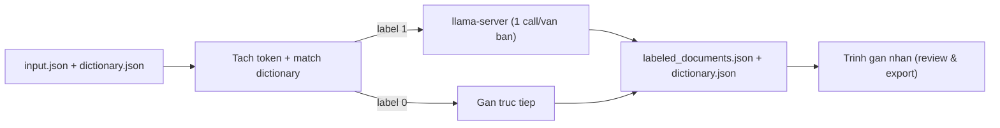

# Abbreviation Resolution

Tự động phân giải (disambiguation) từ viết tắt tiếng Việt bằng LLM chạy trên
[llama.cpp](https://github.com/ggml-org/llama.cpp), kèm giao diện web để chạy và
review kết quả — không cần gõ lệnh hay sửa code.

Kết quả xuất ra JSON **tương thích hoàn toàn** với trình gán nhãn
`dictionary_labeler_v4.html` (gốc), nên bạn có thể mở lại để kiểm tra/sửa và export.

---

## Ý tưởng

- **Đầu vào 1 — văn bản thô:** JSON `list` các object, văn bản nằm ở trường `input`.
- **Đầu vào 2 — từ điển viết tắt:** JSON `list` các object có `word`, `type`,
  `meaning`, `label`. `type` và `meaning` là các danh sách song song ngăn cách bởi
  `/`. `label = 0` (không nhập nhằng) gán trực tiếp; `label = 1` (nhập nhằng) để LLM chọn.

  ```json
  { "word": "TC", "type": "tên tàu/khac", "meaning": "Tàu cá/TC", "label": 1 }
  ```

- **Nhận diện từ viết tắt trong văn bản:** chỉ token IN HOA, không dính chữ
  thường/số; các ký tự `.,:;/-+=()` được coi như khoảng trắng nên `TP-HCM` tách
  thành `TP` và `HCM`. Quy tắc này khớp đúng với biên regex của trình gán nhãn.
- **Gọi LLM một lần cho mỗi văn bản:** mọi từ nhập nhằng trong một văn bản được
  gom lại và hỏi LLM trong **một** request; LLM trả về index nghĩa được chọn cho
  từng từ, hoặc `-1` nếu không nghĩa nào phù hợp.



---

## Chạy nhanh bằng Docker (khuyến nghị)

Yêu cầu: đã có một `llama-server` (llama.cpp) đang chạy và mở cổng OpenAI-compatible,
ví dụ:

```bash
llama-server -m model.gguf --host 0.0.0.0 --port 8080 -c 8192
```

Chạy ứng dụng:

```bash
docker run --rm -p 8000:8000 \
  -e LLAMA_SERVER_URL=http://host.docker.internal:8080/v1 \
  -e LLAMA_MODEL=local-model \
  epsilon1234/abbreviation-resolution:latest
```

Mở trình duyệt tại <http://localhost:8000>:

1. **Bước 1** — chọn file văn bản thô (`.json`) và file từ điển (`.json`).
2. **Bước 2** — kiểm tra URL `llama-server` rồi bấm "Kiểm tra kết nối". (Hoặc bật
   "Chạy thử" để xem pipeline mà không cần model.)
3. **Bước 3** — bấm "Chạy phân giải".
4. Tải `labeled_documents.json` / `dictionary.json`, hoặc bấm
   "Review & sửa trong trình gán nhãn" để mở trang labeler với dữ liệu nạp sẵn.

> Trên Linux, nếu `host.docker.internal` không hoạt động, dùng IP host hoặc thêm
> `--add-host=host.docker.internal:host-gateway`.

### Dùng docker compose

```bash
LLAMA_SERVER_URL=http://host.docker.internal:8080/v1 docker compose up
```

---

## Cấu hình (biến môi trường)

| Biến | Mặc định | Ý nghĩa |
| --- | --- | --- |
| `LLAMA_SERVER_URL` | `http://host.docker.internal:8080/v1` | Base URL OpenAI-compatible của llama-server |
| `LLAMA_MODEL` | `local-model` | Tên model gửi trong request |
| `LLAMA_API_KEY` | (trống) | Bearer token nếu server yêu cầu |
| `LLAMA_TIMEOUT` | `120` | Timeout (giây) cho mỗi request |

URL/model cũng có thể nhập trực tiếp trên giao diện, ghi đè giá trị mặc định.

---

## Định dạng đầu ra (tương thích trình gán nhãn)

`labeled_documents.json`:

```json
[
  {
    "name": "doc1",
    "text": "... TC ...",
    "labels": [
      {
        "start": 4, "end": 6, "term": "TC",
        "senseId": "tc_1", "senseLabel": "Tàu cá", "senseExplanation": "tên tàu",
        "text": "TC", "auto": false, "source": "llm"
      }
    ],
    "replacements": [],
    "meta": { "id": "doc1" }
  }
]
```

`dictionary.json` (map `WORD -> [{id, label, explanation}]`): nạp được trực tiếp qua
ô "Load dictionary" của trình gán nhãn. Các từ `label = 1` có thêm một nghĩa đặc
biệt `(không có nghĩa phù hợp)` để biểu diễn trường hợp `-1`.

`source` trong mỗi nhãn: `rule` (gán trực tiếp), `llm` (LLM chọn), `llm-none`
(LLM cho rằng không nghĩa nào phù hợp).

---

## Phát triển & kiểm thử

```bash
python -m venv .venv && . .venv/Scripts/activate   # Windows PowerShell: .venv\Scripts\Activate.ps1
pip install -r requirements-dev.txt
pytest
uvicorn app.main:app --reload --port 8000
```

Bộ test dùng `MockLLMClient` nên chạy được mà không cần model. Để thử end-to-end
với dữ liệu mẫu, bật "Chạy thử" trên giao diện và tải `sample_data/`.

---

## Cấu trúc dự án

```
app/
  main.py          FastAPI: routes + API
  resolver.py      Logic cốt lõi (tách token, match, gán nhãn) — thuần Python
  llm_client.py    Client llama-server + MockLLMClient + prompt/schema
  static/
    index.html     Trang Auto-resolve (upload + chạy LLM)
    labeler.html   Trình gán nhãn (bản gốc + nút Import + bàn giao localStorage)
sample_data/       Dữ liệu mẫu để thử
tests/             pytest
Dockerfile, docker-compose.yml
```
