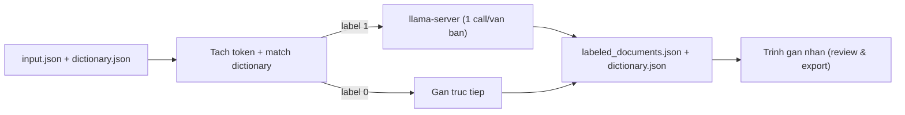

# Abbreviation Resolution

Tự động phân giải (disambiguation) từ viết tắt tiếng Việt bằng LLM chạy trên
[llama.cpp](https://github.com/ggml-org/llama.cpp), kèm giao diện web để chạy và
review kết quả — không cần gõ lệnh hay sửa code.

Kết quả xuất ra JSON **tương thích hoàn toàn** với trình gán nhãn
`dictionary_labeler_v4.html` (gốc), nên bạn có thể mở lại để kiểm tra/sửa và export.

---

## Ý tưởng

- **Đầu vào 1 — văn bản thô:** JSON `list` các object, văn bản nằm ở trường `input`.
- **Đầu vào 2 — từ điển viết tắt:** JSON `list` các object có `word`, `type`,
  `meaning`, `label`. `type` và `meaning` là các danh sách song song ngăn cách bởi
  `/`. `label = 0` (không nhập nhằng) gán trực tiếp; `label = 1` (nhập nhằng) để LLM chọn.

  ```json
  { "word": "TC", "type": "tên tàu/khac", "meaning": "Tàu cá/TC", "label": 1 }
  ```

- **Nhận diện từ viết tắt trong văn bản:** chỉ token IN HOA, không dính chữ
  thường/số; các ký tự `.,:;/-+=()` được coi như khoảng trắng nên `TP-HCM` tách
  thành `TP` và `HCM`. Quy tắc này khớp đúng với biên regex của trình gán nhãn.
- **Gọi LLM một lần cho mỗi văn bản, nhưng phân giải theo TỪNG VỊ TRÍ:** mọi
  *lần xuất hiện* của từ nhập nhằng được đánh số và hỏi trong **một** request; LLM
  trả về index nghĩa cho từng vị trí (hoặc `-1`). Nhờ vậy cùng một từ viết tắt xuất
  hiện nhiều lần trong một văn bản có thể nhận nghĩa khác nhau (xem mục dưới).



---

## Prompt được build như thế nào (per-occurrence)

Mỗi *lần xuất hiện* của một từ nhập nhằng được đánh số `«id»` ngay trước từ trong
văn bản gửi cho LLM (các offset gán nhãn vẫn tính trên văn bản gốc, marker chỉ
dùng trong prompt). Sau đó liệt kê ứng viên nghĩa cho từng `«id»` và yêu cầu chọn
độc lập theo ngữ cảnh quanh vị trí đó.

Ví dụ: văn bản `"Tàu TS-234 di chuyển đến TN TS, thực hiện nhiệm vụ TS"` với từ điển
`TS = Tên tàu/Địa danh/Khác = TS/Trường Sa/Trinh Sát` và `TN = Tên tàu/Khác = TN/Tây Nam`
sẽ tạo prompt (phần USER):

```text
VĂN BẢN (mỗi vị trí cần phân giải được đánh dấu «số» ngay trước từ viết tắt):
"""
Tàu «1»TS-234 di chuyển đến «2»TN «3»TS, thực hiện nhiệm vụ «4»TS
"""

CÁC VỊ TRÍ CẦN PHÂN GIẢI (với mỗi «số», chọn index nghĩa phù hợp nhất theo NGỮ CẢNH QUANH VỊ TRÍ ĐÓ, hoặc -1 nếu không nghĩa nào đúng):
«1» word="TS": [0] (Tên tàu) TS; [1] (Địa danh) Trường Sa; [2] (Khác) Trinh Sát
«2» word="TN": [0] (Tên tàu) TN; [1] (Khác) Tây Nam
«3» word="TS": [0] (Tên tàu) TS; [1] (Địa danh) Trường Sa; [2] (Khác) Trinh Sát
«4» word="TS": [0] (Tên tàu) TS; [1] (Địa danh) Trường Sa; [2] (Khác) Trinh Sát

Cùng một từ ở các vị trí khác nhau có thể có choice khác nhau — hãy xét độc lập từng vị trí.
Trả về JSON theo dạng: {"resolutions": [{"id": <số vị trí>, "choice": <index hoặc -1>}, ...]}
```

LLM trả về ví dụ `{"resolutions":[{"id":1,"choice":0},{"id":2,"choice":1},{"id":3,"choice":1},{"id":4,"choice":2}]}`
→ `«1»TS`=Tên tàu, `«3»TS`=Trường Sa, `«4»TS`=Trinh Sát (ba nghĩa khác nhau cho cùng từ TS).
Chất lượng chọn vẫn phụ thuộc model, nhưng pipeline đã cung cấp đủ ngữ cảnh + cấu
trúc để model phân biệt được từng vị trí.

---

## Chạy nhanh bằng Docker (khuyến nghị)

Yêu cầu: đã có một `llama-server` (llama.cpp) đang chạy và mở cổng OpenAI-compatible,
ví dụ:

```bash
llama-server -m model.gguf --host 0.0.0.0 --port 8080 -c 8192
```

Chạy ứng dụng:

```bash
docker run --rm -p 8000:8000 \
  -e LLAMA_SERVER_URL=http://host.docker.internal:8080/v1 \
  -e LLAMA_MODEL=local-model \
  -v "$PWD/checkpoints:/srv/checkpoints" \
  epsilon1234/abbreviation-resolution:latest
```

> Mount `-v .../checkpoints:/srv/checkpoints` để **giữ checkpoint** (kết quả tạm)
> khi container restart. Có thể mount thêm `config.json` của bạn vào
> `/srv/config.json` nếu muốn cố định cấu hình mặc định.

Mở trình duyệt tại <http://localhost:8000>:

1. **Bước 1** — chọn file văn bản thô (`.json`) và file từ điển (`.json`). Có thể
   chọn **khoảng mẫu** cần xử lý qua *Index bắt đầu / kết thúc* (để trống = chạy hết).
2. **Bước 2** — cấu hình `llama-server` (URL / model / **API key** / timeout /
   checkpoint). Giá trị mặc định nạp từ `config.json`; bấm **"Lưu làm mặc định"**
   để ghi lại. Bấm "Kiểm tra kết nối" / "Test LLM", hoặc bật "Chạy thử" để xem
   pipeline mà không cần model.
3. **Bước 3** — bấm "Chạy phân giải". Tiến trình hiện theo thời gian thực; sau mỗi
   *N* mẫu hệ thống tự lưu **checkpoint**.
4. Tải `labeled_documents.json` / `dictionary.json`, hoặc bấm
   "Review & sửa trong trình gán nhãn" để mở trang labeler với dữ liệu nạp sẵn.
   Mục **"Checkpoints đã lưu"** cho phép tải kết quả tạm, mở trong trình gán nhãn,
   hoặc "Chạy tiếp" từ chỗ bị dừng.

> Trên Linux, nếu `host.docker.internal` không hoạt động, dùng IP host hoặc thêm
> `--add-host=host.docker.internal:host-gateway`.

### Dùng docker compose

```bash
LLAMA_SERVER_URL=http://host.docker.internal:8080/v1 docker compose up
```

---

## Cấu hình

Cấu hình mặc định nằm trong **`config.json`** (ở thư mục làm việc, hoặc đường dẫn
`AR_CONFIG_PATH`). Giao diện nạp các giá trị này lên Bước 2; bạn có thể sửa rồi bấm
**"Lưu làm mặc định"** (`POST /api/config`) để ghi lại.

```json
{
  "llama_server_url": "http://host.docker.internal:8080/v1",
  "llama_model": "local-model",
  "llama_api_key": "sk-1234",
  "llama_timeout": 600.0,
  "temperature": 0.0,
  "checkpoint_every": 20,
  "text_field": "input"
}
```

**Thứ tự ưu tiên (thấp → cao):** giá trị mặc định trong code → `config.json` →
**biến môi trường** → **trường nhập trên giao diện cho lần chạy đó**. Nhờ vậy biến
môi trường vẫn ghi đè được khi triển khai Docker/CI, còn ô nhập trên UI luôn quyết
định cho request hiện tại.

| Trường (config.json) | Biến môi trường | Mặc định | Ý nghĩa |
| --- | --- | --- | --- |
| `llama_server_url` | `LLAMA_SERVER_URL` | `http://host.docker.internal:8080/v1` | Base URL OpenAI-compatible của llama-server |
| `llama_model` | `LLAMA_MODEL` | `local-model` | Tên model gửi trong request |
| `llama_api_key` | `LLAMA_API_KEY` | `sk-1234` | Bearer token (đặt rỗng nếu server không yêu cầu) |
| `llama_timeout` | `LLAMA_TIMEOUT` | `600` | Timeout (giây) cho mỗi request |
| `temperature` | `LLAMA_TEMPERATURE` | `0.0` | Temperature khi gọi LLM |
| `checkpoint_every` | `AR_CHECKPOINT_EVERY` | `20` | Lưu checkpoint sau mỗi N mẫu (0 = tắt) |
| `text_field` | `AR_TEXT_FIELD` | `input` | Tên trường chứa văn bản trong file đầu vào |
| — | `AR_CONFIG_PATH` | `config.json` | Đường dẫn file cấu hình |
| — | `AR_CHECKPOINT_DIR` | `checkpoints` | Thư mục lưu checkpoint |

---

## Chọn khoảng mẫu & Progressive saving (checkpoint)

- **Chọn khoảng mẫu:** ở Bước 1, nhập *Index bắt đầu* / *Index kết thúc* (0-based,
  **bao gồm cả hai đầu**). Để trống đầu = từ 0; để trống cuối = đến mẫu cuối. Ví dụ
  `bắt đầu=0, kết thúc=49` → xử lý 50 mẫu đầu.
- **Checkpoint:** cứ sau `checkpoint_every` mẫu, một bản chụp đầy đủ (tương thích
  trình gán nhãn) được ghi vào `{AR_CHECKPOINT_DIR}/{run_id}.json`. Nếu bị timeout
  hay rớt kết nối, công sức không mất: mở mục **"Checkpoints đã lưu"** để tải JSON,
  mở trong trình gán nhãn, hoặc bấm **"Chạy tiếp"** — nút này đặt *Index bắt đầu*
  bằng `next_index` của checkpoint để chạy nốt phần còn lại.

---

## Định dạng đầu ra (tương thích trình gán nhãn)

`labeled_documents.json`:

```json
[
  {
    "name": "doc1",
    "text": "... TC ...",
    "labels": [
      {
        "start": 4, "end": 6, "term": "TC",
        "senseId": "tc_1", "senseLabel": "Tàu cá", "senseExplanation": "tên tàu",
        "text": "TC", "auto": false, "source": "llm"
      }
    ],
    "replacements": [],
    "meta": { "id": "doc1" }
  }
]
```

`dictionary.json` (map `WORD -> [{id, label, explanation}]`): nạp được trực tiếp qua
ô "Load dictionary" của trình gán nhãn. Các từ `label = 1` có thêm một nghĩa đặc
biệt `(không có nghĩa phù hợp)` để biểu diễn trường hợp `-1`.

`source` trong mỗi nhãn: `rule` (gán trực tiếp), `llm` (LLM chọn), `llm-none`
(LLM cho rằng không nghĩa nào phù hợp).

---

## Phát triển & kiểm thử

```bash
python -m venv .venv && . .venv/Scripts/activate   # Windows PowerShell: .venv\Scripts\Activate.ps1
pip install -r requirements-dev.txt
pytest
uvicorn app.main:app --reload --port 8000
```

Bộ test dùng `MockLLMClient` nên chạy được mà không cần model. Để thử end-to-end
với dữ liệu mẫu, bật "Chạy thử" trên giao diện và tải `sample_data/`.

---

## Cấu trúc dự án

```
app/
  main.py          FastAPI: routes + streaming /api/resolve + config + checkpoints
  config.py        Đọc/ghi config.json (defaults <- file <- env)
  checkpoints.py   Lưu/đọc/liệt kê checkpoint (atomic, chống path traversal)
  resolver.py      Logic cốt lõi (tách token, match, gán nhãn) — thuần Python
  llm_client.py    Client llama-server + MockLLMClient + prompt/schema + logging
  static/
    index.html     Trang Auto-resolve (range, config, checkpoint, streaming)
    labeler.html   Trình gán nhãn (load JSON + nút Import + bàn giao localStorage)
config.json        Tham số mặc định, nạp lên giao diện (sửa được trên UI)
sample_data/       Dữ liệu mẫu để thử
tests/             pytest
Dockerfile, docker-compose.yml
```

---

## Streaming protocol (cho người tự tích hợp API)

`POST /api/resolve` trả `application/x-ndjson` — mỗi dòng là một JSON event:

Form fields: `input_file`, `dictionary_file`, `llama_url`, `model`, `api_key`,
`temperature`, `timeout`, `dry_run`, `text_field`, `start_index`, `end_index`,
`checkpoint_every` (mọi field cấu hình đều tùy chọn — bỏ trống sẽ lấy từ `config.json`).

```jsonc
{"event":"start", "run_id":"run_20260617_010000_ab12cd", "total":50, "total_in_file":1000,
                  "start_index":0, "end_index":49, "checkpoint_every":20,
                  "dictionary_words":6, "ambiguous_words":2, "dry_run":false}
{"event":"document_start", "index":1, "source_index":0, "total":50, "name":"doc1", "text_len":144}
{"event":"document_done",  "index":1, "source_index":0, "total":50, "name":"doc1",
                           "labels":5, "direct":3, "llm":2, "none":0, "elapsed_ms":2310}
{"event":"document_error", "index":2, "source_index":1, "total":50, "name":"doc2",
                           "error_type":"LLMError", "error":"..."}
{"event":"heartbeat", "index":3, "source_index":2, "name":"doc3", "waited_s":20}
{"event":"checkpoint", "run_id":"run_...", "processed":20, "next_index":20, "file":"run_....json"}
{"event":"done", "run_id":"run_...", "next_index":50, "documents":[...], "dictionary":{...},
                 "summary":{"documents":50,"terms":140,"direct":90,"llm":50,"none":0}}
{"event":"fatal", "run_id":"run_...", "error_type":"...", "error":"..."}   // chỉ khi stream chết toàn cục
```

Các endpoint phụ trợ: `GET /api/config`, `POST /api/config`,
`GET /api/checkpoints`, `GET /api/checkpoints/{run_id}`.

Vì sao streaming? Một request resolve có thể mất nhiều phút khi LLM chậm. Với
JSON buffered (chế độ cũ), proxy/firewall doanh nghiệp thường reset connection
POST đang idle → browser nhận `NetworkError`. Streaming 1 event/văn bản giữ
luồng byte chảy liên tục và đồng thời cho UI biết tiến trình thật.

---

## Troubleshooting

### "NetworkError when attempting to fetch resource" khi bấm "Chạy phân giải"

Phổ biến trong môi trường doanh nghiệp; bạn cần kiểm tra theo thứ tự:

1. **Xem log uvicorn**. Phiên bản từ `1.1.0` log mọi request tới LLM kèm timing:
   ```
   [app.llm_client] INFO: POST http://.../v1/chat/completions | bytes=1843 | model=qwen3.6 | connect=10.0s read=120.0s | trust_env=False
   [app.llm_client] INFO: POST http://.../v1/chat/completions -> HTTP 200 in 12.34s
   ```
   Nếu không thấy log "-> HTTP ..." → LLM chưa trả về (hang / quá chậm).
2. **Bấm "Test LLM" trên giao diện** (hoặc `POST /api/test-llm`). Endpoint này
   gửi prompt nhỏ nhất qua cùng `httpx.Client` mà pipeline thật dùng:
   - Trả về OK + `elapsed_ms` → LLM healthy; vấn đề là prompt thật chậm hoặc
     proxy/firewall reset connection dài. Streaming (đã bật mặc định) thường
     đã giải quyết.
   - Trả về lỗi `ConnectError`/`ConnectTimeout` → app không vào được LLM (
     khác với curl từ máy bạn): kiểm tra `LLAMA_SERVER_URL`, DNS trong
     container, proxy env.
3. **Bypass proxy doanh nghiệp**. `LLMClient` đặt `trust_env=False` để
   **bỏ qua** `HTTP_PROXY`/`HTTPS_PROXY`/`NO_PROXY` của môi trường — đây là
   nguyên nhân kinh điển khiến "curl OK mà Python hang". Nếu bạn THỰC SỰ
   cần qua proxy, sửa code (`trust_env=True`) hoặc đặt `NO_PROXY=192.168.*`.
4. **Tăng `LLAMA_TIMEOUT`** nếu model chậm (mặc định 600s; chỉnh trực tiếp ô
   *Timeout* trên giao diện cho lần chạy đó).
5. **Tăng nhẹ keep-alive trong UI**: streaming đã đẩy 1 dòng/văn bản nên
   connection không bao giờ idle quá thời gian xử lý 1 văn bản. Nếu vẫn bị
   reset, có thể proxy reset cả connection có data mà response chưa đóng → cần
   liên hệ team mạng để whitelist.

### "Error in body stream" / stream đứt giữa chừng nhưng server vẫn chạy

Triệu chứng: log uvicorn vẫn xử lý và **vẫn tạo checkpoint**, nhưng giao diện báo
`Error in body stream` (Firefox) hoặc `NetworkError` và ngừng cập nhật log.

Nguyên nhân: có proxy/tường lửa giữa trình duyệt và uvicorn. Khi đang gọi LLM cho
một văn bản, stream **không có byte nào chảy** trong vài chục giây → proxy coi là
idle và **cắt phía trình duyệt**, trong khi vẫn giữ kết nối phía server (nên server
chạy tiếp và checkpoint tiếp).

Cách xử lý (đã tích hợp từ `1.3.0`):

1. **Heartbeat**: server gửi 1 dòng `{"event":"heartbeat"}` mỗi ~10s trong lúc chờ
   LLM nên stream không bao giờ idle lâu — giải quyết phần lớn trường hợp idle-timeout.
2. **Tự khôi phục từ checkpoint**: nếu stream vẫn đứt (proxy cắt cứng theo tổng thời
   gian), giao diện sẽ tự **poll `/api/checkpoints`** theo `run_id`; khi server chạy
   xong (checkpoint `done`) thì nạp kết quả như bình thường. Cần bật checkpoint
   (`checkpoint_every > 0`).
3. **Khôi phục thủ công**: mở mục "Checkpoints đã lưu" → *Tải JSON* / *Trình gán nhãn*,
   hoặc *Chạy tiếp* (đặt `start_index = next_index`).
4. **Triệt để**: kết nối trình duyệt thẳng tới uvicorn (không qua proxy), hoặc nhờ
   team mạng whitelist host:port, hoặc đặt `NO_PROXY` phù hợp.

### "Kiểm tra kết nối" OK nhưng "Chạy phân giải" hỏng

Hai endpoint dùng đường HTTP khác nhau ở phía LLM:
`/v1/models` (nhỏ, nhanh) vs `/v1/chat/completions` (lớn, chậm). Vậy nên
"Kiểm tra kết nối" pass không đảm bảo chat hoạt động. **Hãy luôn bấm "Test LLM"
trước khi chạy real workload.**

### `Ctrl + C` không thoát uvicorn

Uvicorn graceful shutdown đợi mọi request đang chạy xong. Khi LLM treo, request
kẹt đến hết `LLAMA_TIMEOUT`. Bấm **`Ctrl + C` hai lần liên tiếp** để force-kill,
hoặc chạy uvicorn với `--timeout-graceful-shutdown 5`.

### `NetworkError` khi mở qua nginx / Cloudflare / proxy ngược

Phiên bản hiện tại đã set header `X-Accel-Buffering: no` và `Cache-Control:
no-cache`. Nếu proxy của bạn không tôn trọng các header này, tắt buffering thủ
công ở proxy (nginx: `proxy_buffering off;`).
